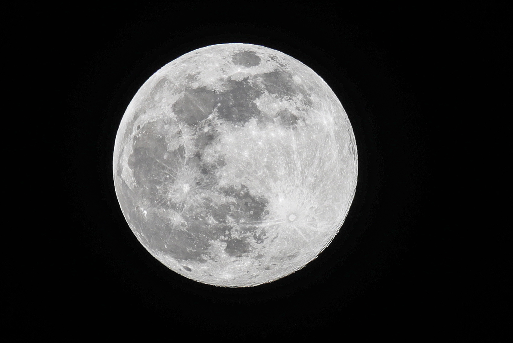

<h1 align="center">
    

![Tech html][HTML]
![Tech css][CSS]
![Tech Js][Javascript]
</h1>

---

[Javascript]: https://img.shields.io/twitter/url?color=yellow&label=javascript&logo=javascript&logoColor=yellow&style=flat-square&url=https%3A%2F%2Fshields.io
[HTML]: https://img.shields.io/twitter/url?color=red&label=HTML5&logo=html5&logoColor=red&style=flat-square&url=https%3A%2F%2Fshields.io
[CSS]: https://img.shields.io/twitter/url?color=blue&label=CSS3&logo=css3&logoColor=9cf&style=flat-square&url=https%3A%2F%2Fshields.io
 
<h1 align="center">
    
</h1>
